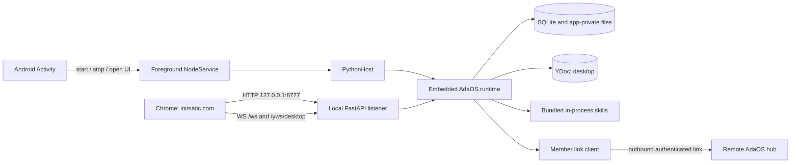

# AdaOS Android Full Node

Status: target architecture for an experimental proof of concept.

Implementation status: the first A0/A1/A2/A3/A4/A5 vertical slice and the A6
member-protocol slice are implemented under
`src/adaos/integrations/android-node` and have been exercised on an Android 16
Samsung SM-F721N. Together they prove the Android lifecycle, embedded CPython
3.11, app-private identity, loopback discovery, hosted-client LO connection,
browser control channel, native Android `y-py`, an SQLite-backed YStore, and
`web_desktop` rendering from the real local YDoc. The YDoc has been updated
over `/yws/desktop` and recovered after a forced process stop. The immutable
`android_poc_v1` profile executes Weather, AdaOS Connect, Notebook, subnet
environment, and Taiga demo metrics in-process; the browser has rendered
persisted Notebook data, the editable subnet environment, AdaOS Connect, and
the Taiga metrics table/tree/chart/selection from that profile. The outbound
member client has also joined a protocol-compatible Root/Hub fixture, survived
a process restart and hub outage, and exchanged Yjs updates in both
directions. A deployed-subnet run, Android Keystore custody, and the 2 GB
device gate remain owned by the
[Android Full Node Roadmap](android-full-node-roadmap.md).

## Purpose

This document defines how a modern Android phone can run a real AdaOS member
node instead of acting only as a thin endpoint. The phone runs the Python
runtime, local skills, SQLite and Yjs state, an outbound member link, and a
loopback browser API. The hosted client at `https://inimatic.com` remains the
primary UI and connects to the phone through the existing `LO` deployment zone.

The first implementation is deliberately an experiment. Its purpose is to
prove one complete path on a physical phone with approximately 2 GB of RAM:

```text
Android app start
  -> embedded CPython and AdaOS runtime
  -> local webspace and bundled in-process skills
  -> Yjs projection and browser event stream
  -> https://inimatic.com using LO
  -> optional outbound member link to a hub
```

This is distinct from ReDevice. ReDevice remains the specialized solution for
very old, 32-bit, or highly constrained Android devices. The Android full-node
track starts with a deliberately higher platform floor and does not replace the
[Endpoint Infrastructure](endpoint-infrastructure.md) or legacy ReDevice path.

## Target Decisions

The initial architecture fixes the following decisions so the first build can
optimize for learning rather than breadth.

| Concern | Initial decision |
| --- | --- |
| Product role | Experimental full AdaOS member node with a local browser surface |
| Minimum Android | Android 8.0, API 26 |
| Initial ABI | `arm64-v8a` only |
| Initial Python | Embedded CPython 3.11 |
| Android shell | Small native Kotlin application |
| Python embedder | Chaquopy for the first spike, behind a replaceable host boundary |
| Lifecycle owner | One user-started Android foreground `NodeService` |
| Runtime processes | One Android process and one embedded Python runtime |
| Skill execution | Curated in-process skills only |
| Local API | `127.0.0.1:8777`, HTTP and WebSocket |
| Browser UI | Hosted `https://inimatic.com`, deployment zone `LO` |
| Default webspace | `desktop` with `web_desktop` as its home scenario |
| Installation | Immutable, versioned bundle packaged with the APK |
| Core update | Android application update; no `pip` or A/B core switch in the PoC |
| Audio, media, WebRTC | Disabled in the first slice |
| Memory hypothesis | A useful node can operate on a 2 GB arm64 phone without `largeHeap` |

Chaquopy is an implementation choice for the first build, not a permanent
AdaOS contract. The stable boundary is an Android `PythonHost` which can start
and stop one embedded interpreter, invoke the AdaOS entry point, and receive
structured lifecycle state. A future direct `libpython` integration or another
embedder may replace it without changing AdaOS runtime semantics.

## Supported Android Envelope

### Lower boundary

The first supported platform is Android 8.0 / API 26. This is high enough to
use the foreground-service and notification-channel model consistently while
still covering the older 64-bit phones that motivate the experiment. It also
avoids spending the PoC on compatibility work already served by ReDevice.

Only `arm64-v8a` is packaged initially. `armeabi-v7a`, x86 devices, and Android
versions below API 26 are outside this track.

### Upper boundary

There is no architectural upper Android version. The first build should use
`targetSdk 36` and `compileSdk 36`, then validate behavior rather than encode a
maximum OS version. Native libraries must support both 4 KB and 16 KB memory
page-size devices so Android 15 and later do not become an artificial ceiling.

The initial device matrix covers:

- API 26 for the lower boundary;
- API 30 or 31 for a representative older mainstream phone;
- API 34 for modern foreground-service enforcement;
- API 36 for the current target behavior.

## System Boundary



The native shell owns Android lifecycle. Python owns AdaOS domain behavior.
The browser remains an independent application and reaches the service through
the device loopback interface.

## Android Shell and Lifecycle

The Android application contains only the UI and lifecycle code needed to host
the node:

- a status screen with `Start node`, `Stop node`, and `Open AdaOS` actions;
- a persistent foreground-service notification while the node is running;
- a non-exported `NodeService` which owns the Python runtime;
- a small structured status bridge from Python to Kotlin;
- an app-private data root supplied to Python explicitly;
- a diagnostic export action for the PoC.

Starting the node is a visible user action. The Activity calls
`startForegroundService`, and the service promotes itself immediately with a
clear notification. The first slice does not start itself from a boot receiver
or from a background broadcast. This avoids Android 12+ background-start
restrictions and keeps energy use explicit.

The service and Activity may share one application process in the first build.
The service owns runtime state; the Activity can be destroyed and recreated
without stopping the node. `android:exported="false"` prevents another app from
starting or binding the service directly.

Android can still terminate the process under memory pressure or when the user
stops the app. Therefore all durable state is flushed independently of the
Activity, and startup must be idempotent. Automatic boot recovery and a more
capable Android lifecycle controller are post-PoC work.

## Embedded Python Runtime

### Python version

The first build uses CPython 3.11 because the current project metadata, skill
manifests, custom `y-py` fork, and test surface already converge there. The
current exact `>=3.11.9,<3.12` constraint is historical rather than a target
platform invariant. It may be relaxed after the Android slice and existing
desktop tests pass on a wider supported range. Changing Python version is not
required to get the first phone running.

### Android runtime profile

AdaOS gains an explicit runtime profile, provisionally
`ADAOS_RUNTIME_PROFILE=android_poc`. The profile changes composition, not
domain semantics.

Enabled in the first useful browser slice:

- `AgentContext` and local event bus;
- SQLite-backed runtime and skill memory;
- Yjs document/store and the `desktop` webspace;
- scenario projection and WebIO runtime;
- local FastAPI routes required by the browser;
- `/ws` events and `/yws/<webspace>` synchronization;
- curated in-process skill loading;
- outbound member-link client when membership is configured.

Disabled:

- `adaos-supervisor` and realtime sidecar;
- service skills and skill subprocesses;
- per-skill virtual environments and shell preparation;
- Rasa, neural NLU, Builder, model runtimes, and MCP workers;
- audio capture, native TTS, media server, `sounddevice`, and `pyttsx3`;
- `aiortc`, WebRTC, and media proxy paths;
- core A/B slot promotion and self-update;
- git-backed install/update flows and runtime `pip` mutation;
- broad host inspection which assumes Linux, Windows, or macOS.

This profile should be expressed through typed capability gates. Android checks
must not spread across business logic as repeated `sys.platform` branches.

### Event-loop ownership

The `NodeService` starts one dedicated Python runtime thread. That thread owns
one asyncio loop and the AdaOS bootstrap task. Uvicorn runs programmatically in
that loop or in another managed thread in the same process; it must not spawn a
child process. Stop follows one ordered sequence:

1. stop accepting local HTTP and WebSocket work;
2. disconnect the member link;
3. drain skill and event subscriptions;
4. flush Yjs, SQLite, and skill memory;
5. stop the Python loop;
6. remove the foreground notification.

Closing the listener precedes draining already accepted request threads, so a
polling browser cannot keep admitting work during shutdown. An in-flight
status request may observe an explicit `ready=false`, `node_state=stopped`
snapshot; it must not read partially cleared runtime or skill state.

## Dependency and Native-Wheel Strategy

The Android build must not install the complete desktop dependency list from
`pyproject.toml`. It uses a curated, locked Android dependency closure produced
at build time. Runtime downloads and compilation on the phone are forbidden in
the PoC.

### Mandatory native proof

`y-py` is the first mandatory native dependency. AdaOS already owns a patched
fork and release-wheel pipeline, so the missing Android arm64 wheel is a
cross-compilation and validation task rather than an upstream availability
blocker. The wheel must:

- target CPython 3.11 and Android arm64;
- load in the embedded interpreter;
- create, update, encode, and apply a YDoc update;
- survive persistence and reload through the AdaOS YStore;
- be built with native-library alignment suitable for 16 KB page-size devices.

The build must audit the full transitive native closure, not only direct
dependencies. Likely native packages include `pydantic-core`, `cryptography`,
`psutil`, `greenlet`, and optional C extensions in otherwise portable
packages.

### Adaptation policy

| Dependency or assumption | First-slice policy |
| --- | --- |
| `y-py` | Build and ship the AdaOS fork for Android arm64 |
| `cryptography` | Ship an Android build if required by the member-link/mTLS slice; keep secrets in app-private storage and migrate key custody toward Android Keystore |
| `psutil` | Do not require it for bootstrap; expose a reduced Android diagnostics adapter |
| `sounddevice`, `pyttsx3` | Exclude; later use Android media and TTS APIs through an adapter |
| `aiortc`, PyAV | Exclude; baseline browser correctness is HTTP/WS/YWS |
| `subprocess`, POSIX signals | Reject in the Android profile unless a later feature has an explicit native owner |
| virtual environments | Replace with immutable packaged dependencies and the install descriptor |

Pure-Python packages are bundled only when the selected runtime and content
actually import them. Build output records package versions, hashes, ABI,
Python version, native library alignment, and source provenance.

## Supervisor and Skill Boundary

The absence of the desktop supervisor is not a blocker. Android and the
foreground `NodeService` become the outer lifecycle authority for the first
slice. A later Android controller may add watchdog, bounded restart, health,
and package-update coordination, but it must use Android lifecycle APIs rather
than emulate POSIX process supervision.

Skills are not inherently incompatible with Android. The incompatible part is
the current general installation and isolation machinery when it assumes:

- a writable virtual environment;
- `pip` at runtime;
- subprocess execution;
- POSIX signals;
- a separate service process;
- A/B runtime buckets prepared on the device.

The PoC therefore permits only reviewed in-process skills which are packaged
with the application. Service skills and arbitrary marketplace installation
remain unavailable. The normal skill SDK, event subscriptions, tools, skill
memory, Yjs projections, and streams remain valid.

## Immutable Installation Profile

The APK contains a versioned install descriptor named `android_poc_v1`. It
records exact artifact versions and hashes. On first start, the application
materializes the bundle into its private AdaOS workspace and activates it
without using git, `pip`, a virtual environment, or subprocess preparation.

The logical contents are:

```yaml
id: android_poc_v1
default_webspace: desktop
home_scenario: web_desktop

scenarios:
  - web_desktop
  - taiga_ui_demo_scenario

skills:
  - web_desktop_skill
  - subnet_env
  - weather_skill
  - adaos_connect
  - notebook_skill
  - demo_metrics_skill

runtime:
  execution: in_process
  service_skills: disabled
  dynamic_install: disabled
```

`demo_metrics_skill` is the required runtime companion of
`taiga_ui_demo_scenario`. The standard desktop preset already includes
`adaos_connect` and `taiga_ui_demo_scenario`; it does not include
`weather_skill` or `notebook_skill`. The Android profile is intentionally not a
copy of the standard preset because that preset also activates heavyweight or
unsupported content.

`web_desktop` must declare only `web_desktop_skill` as required. Greeting,
pairing, voice, and other host capabilities become optional scenario skills.
This uses the required/optional model from
[Skill Activation and Scenario Binding](skill-activation-and-scenario-binding.md)
and prevents scenario installation from silently expanding the Android bundle.

`web_desktop` remains the home scenario. Taiga UI is installed as an alternate
scenario so switching `web_desktop -> taiga_ui_demo_scenario -> web_desktop`
also tests pointer-first scenario switching and Yjs reconciliation.

### Why these skills

- `subnet_env` gives a small deterministic tool-to-Yjs path with no external
  dependency.
- `weather_skill` exercises browser geolocation, outbound HTTP, bounded caches,
  and a visible Yjs projection under `data/weather`.
- `adaos_connect` exercises Root/member-link orchestration and the
  `data/adaos_connect/current` projection. Root-dependent actions degrade
  visibly while offline instead of blocking desktop boot.
- `notebook_skill` exercises local writes, skill memory, Yjs summary state,
  stream snapshots, restart rehydration, and browser uploads. Plain-text notes
  are the MVP gate; attachments and Telegram export are secondary checks.
- `demo_metrics_skill` and the Taiga scenario exercise a table, tree, chart,
  shared selection, typed actions, and a live event receiver without external
  native dependencies.

## Local Browser and the LO Zone

The browser-facing endpoint is the existing LO contract:

```text
http://127.0.0.1:8777
```

The listener binds only to IPv4 loopback. It is never exposed on `0.0.0.0` in
the first profile. The minimum browser surface includes:

- `GET /api/node/status` for discovery and identity;
- the existing bootstrap/materialization routes required by the desktop;
- `/ws` for event and control traffic;
- `/yws/desktop` for Yjs synchronization;
- skill tool, action, upload, and read routes required by the fixed bundle.

LO describes transport locality, not node role. A browser connected to LO may
be talking to a member node. The phone does not become a hub merely because it
serves a loopback browser API.

### Browser launch flow

The reliable first-launch path is:

1. the user starts the node in the Android app;
2. the local runtime reports API and Yjs readiness;
3. the user taps `Open AdaOS`;
4. Android opens
   `https://inimatic.com/?zone=lo&try_local_hub=1` in the default browser;
5. Chrome asks once for Local Network Access when required;
6. the client probes `/api/node/status`, selects LO, and opens `/ws` and
   `/yws/desktop`;
7. later visits may reuse the persisted LO intent and browser permission.

Chrome cannot be granted Local Network Access by the Android application. The
first browser approval is therefore an expected platform interaction, not an
AdaOS login. The client should make explicit LO intent win over a remembered
remote owner session without deleting that remote session.

The current browser's local-hub naming is legacy. New code should describe this
as local-runtime discovery because the endpoint can be either a hub or member.

## Local Trust Model

Local connection does not require user authentication or pairing. The product
assumption is that a person with direct access to the device is its owner.

The Android listener disables `require_token` and advertises
`local_auth_required=false` during discovery. The hosted client therefore does
not send `dev-local-token` to this listener. Older local runtimes which do not
advertise the capability retain their compatibility behavior.

The actual local boundaries are:

- the listener binds only to `127.0.0.1`;
- the Android service is not exported;
- browser CORS and WebSocket Origin policy admit `https://inimatic.com` and
  explicit development origins rather than arbitrary public sites;
- Chrome mediates public-origin access to loopback through Local Network
  Access permission;
- remote member/hub and Root links continue to use their normal credentials.

Under this trust model, another installed application which can reach the
loopback port is also inside the accepted local-device trust boundary. If that
assumption changes, local session authentication is a later security feature,
not something that should be simulated with a globally known development
token.

## Yjs and Browser Data Flow

The Android node owns a normal local `desktop` YDoc. The same runtime services
used on desktop seed and reconcile it:

1. the install descriptor materializes `web_desktop` and its selected skills;
2. scenario projection writes `ui.application` and scenario metadata;
3. active skill `webui.json` declarations contribute catalog, widget, modal,
   route, and receiver definitions;
4. alternate scenario projection overlays its surface on the desktop-wide
   application contract; it must not discard shared catalog modals or other
   required branches;
5. skill projections write bounded durable state under `data/...`;
6. high-churn or append-oriented skill output uses WebIO streams;
7. the browser receives the document through `/yws/desktop` and renders it;
8. browser actions invoke local tools/events and observe the resulting Yjs or
   stream change.

Retained CRDT history is bounded independently from current semantic state.
The Android YStore structurally rebuilds an over-limit snapshot on startup,
increments a persisted generation number, and exposes snapshot pressure in
`/api/node/status`. Browser authorization announces that generation. The
client uses a generation-qualified physical YWS room while keeping the logical
webspace id `desktop`; this prevents an old tab's cross-tab BroadcastChannel
from replaying pre-compaction history into the rebuilt store. A client that
reconnects with a stale qualified generation receives
`ystore_generation_mismatch` and performs a hard reload. Inbound YWS updates
and member-link queues also have explicit size/count limits.

The control-channel acknowledgement is authoritative. A positive ACK means the
named command was implemented and its mutation was accepted. Unsupported
commands receive a negative ACK; they must never fall through as successful
no-ops. In particular, `desktop.webspace.go_home` restores `web_desktop` and
its complete materialization after an alternate scenario. HTTP materialization
diagnostics are calculated from the same live YDoc and cannot claim `ready`
while required branches are absent.

The first vertical proof covers several paths rather than a synthetic page:

- Weather: browser location or city -> skill event/tool ->
  `data/weather/current` -> widget;
- Notebook: create/save -> skill memory plus Yjs summary/stream -> editor and
  list -> restart rehydration;
- Taiga UI: demo snapshot -> Yjs table/tree/chart -> selection -> live stream
  event;
- AdaOS Connect: prepare action -> Root/member orchestration -> Yjs QR and
  instructions, or an explicit offline state.

Before membership is configured, this document is local and standalone. After
the phone joins a subnet, the existing member-link and webspace ownership rules
govern convergence with the hub. Joining must not make the local browser depend
on a routed Root browser path; LO remains usable during hub or WAN outage.

## Member Connectivity

The phone is member-first. It establishes outbound connectivity using the
existing durable membership contract and member-link client described in
[Member-Hub Connectivity](member-hub-connectivity.md). No inbound LAN listener
is required for hub membership.

The PoC5 Android profile implements:

- membership persistence in app-private storage;
- credentials separate from the unauthenticated loopback listener;
- bounded reconnect with backoff;
- semantic `offline`, `connecting`, `connected`, and expected-transition
  states;
- local desktop availability while the upstream link is down;
- Yjs and member snapshot convergence after reconnect.

AdaOS Connect accepts a Root URL and one-time join code, calls the existing
join contract (with the compatibility endpoint as fallback), and persists the
resolved Hub URL, subnet id, and credential in a separate app-private member
configuration. The secret is never projected into Yjs or status responses.
The client is outbound-only, supports `ws` and system-CA-validated `wss`, uses
bounded exponential reconnect backoff and a bounded send queue, and can be
explicitly disconnected and forgotten. The checked-in Root/Hub fixture proves
the protocol and failure states; it is not a substitute for the roadmap's
deployed-subnet acceptance run or later Android Keystore custody.

The desktop supervisor and realtime sidecar are not required for the first
member link. Android owns process lifetime and the Python runtime owns the live
outbound connection. Sidecar-compatible transport ownership remains a future
optimization, not a correctness dependency.

## Persistence and Storage

All mutable files live under the application-private files directory supplied
by Android. Python must not infer a home directory or write beside packaged
assets.

The private layout contains:

- node and membership configuration;
- SQLite databases;
- Yjs store and webspace registry;
- skill memory and Notebook content;
- materialized immutable scenario/skill bundle;
- bounded logs and diagnostics;
- install descriptor and migration marker.

Packaged assets are read-only. First-run materialization is transactional: a
versioned temporary location is verified and then promoted. Application update
preserves mutable state, verifies the new bundled content, runs explicit data
migrations, and can reconstruct immutable bundle files from the APK.

## Update Model

A/B core slots and runtime `pip` update do not fit the Android package model,
but this is not a blocker.

For the PoC:

- the APK/AAB is the immutable core and native dependency unit;
- Android package installation is the core activation boundary;
- the application version identifies the AdaOS core and bundled content set;
- mutable data survives application update;
- rollback is performed by installing a previously signed application build
  during the experiment;
- no executable Python or native dependency is updated in place.

Later work may allow signed data-only or reviewed pure-Python content bundles,
but native wheels and core code should remain application-versioned until a
separate Android update authority is designed. The desktop A/B contract must
not be emulated inside app storage merely for structural parity.

## Native Capability Adaptation

Android-specific hardware features belong behind existing AdaOS ports and SDK
capabilities:

- memory and process observations through Android APIs rather than assuming
  complete `psutil` behavior;
- secrets and long-lived key custody through Android Keystore;
- files and uploads through app-private storage and the system picker;
- future audio through AudioRecord/AudioTrack and Android TTS;
- future camera through CameraX or another native adapter;
- future low-latency media through Android-native WebRTC or separately proven
  Python wheels.

The first profile reports unavailable capabilities explicitly. It does not
provide fake desktop implementations or allow import failures to crash the
runtime.

## Resource Model

The 2 GB device target is a hypothesis to validate, not a claim of broad
support. The first build must not request `largeHeap`.

Initial budgets for the AdaOS application process are:

- preferred steady idle PSS at or below 200 MiB;
- startup peak PSS at or below 320 MiB;
- bounded skill and projection caches;
- no unbounded event, stream, log, note, or Yjs queues;
- no service-skill child processes;
- no eager import of disabled media, NLU, Builder, or model stacks.

A steady state between 200 and 300 MiB is diagnostic evidence requiring
optimization before widening the pilot. Measurements must separate the AdaOS
process from Chrome, because the browser is an independent Android process.

PoC6 makes these limits executable. A small procfs adapter samples the Android
process PSS, RSS, high-water mark, swap, thread count, device RAM, and page
size without importing `psutil`. Status publishes both the current/observed
peak sample and a `resource_bounds` contract. The loopback listener admits at
most 32 request threads with a backlog of 16; the YStore owner queue admits 64
tasks; the outbound member link admits 128 messages. Notebook storage admits
256 notes, projects the 32 most recent notes, limits each projected/stored
content value to 16,384 characters, and retains at most 256 idempotency results. Yjs
snapshot, update-count, journal-byte, inbound-update, and WebSocket-message
limits remain independently enforced. The application manifest explicitly
sets `largeHeap=false`.

The lifecycle verifier treats `START_NOT_STICKY` as user intent: Activity
recreation must not restart the Python runtime, while the visible Stop path
must flush and destroy the service and remain stopped. Debug builds expose
explicit start/stop Activity actions solely so adb can exercise those same UI
methods deterministically; they do not exist as an exported service contract.

## Observability

The Android status screen and notification expose only a compact state:

- stopped, starting, ready, degraded, or failed;
- local API ready and port;
- Yjs ready and default webspace;
- member-link state;
- active install profile and build version;
- current and peak memory sample;
- last bounded error summary.

Detailed logs remain in app-private storage and can be exported deliberately.
Secrets, join payloads, private keys, and tokens must be redacted. Browser
diagnostics should distinguish local API readiness, local Yjs sync, and remote
member-link state instead of flattening them into one online flag.

## Target Invariants

The implementation must preserve these invariants:

1. Android owns process lifecycle; AdaOS owns domain runtime lifecycle.
2. The first runtime uses no child processes.
3. LO is bound only to loopback and does not change the node's member role.
4. Local browser use has no login or pairing UX.
5. Remote links retain normal authentication even though local access is
   trusted.
6. Yjs is the real browser state path; the PoC does not use a fake native UI or
   mock-only document.
7. The APK contains an immutable, reproducible runtime and content bundle.
8. Skills outside the descriptor cannot become active accidentally.
9. Unsupported native capabilities degrade explicitly.
10. ReDevice remains the path for devices below the Android/ABI/resource floor.
11. Control ACKs and materialization diagnostics describe actual applied Yjs
    state; alternate scenarios cannot leave the browser in false recovery.
12. Structural Yjs compaction changes the physical browser sync generation;
    tabs from an older generation cannot share cross-tab state with it.

## Non-Goals for the First PoC

The first PoC does not include:

- phone-as-hub operation;
- 32-bit Android or Android below API 26;
- Play Store production rollout;
- silent boot start or guaranteed 24/7 daemon semantics;
- arbitrary marketplace installation;
- service skills, per-skill venvs, subprocess isolation, or shell access;
- supervisor, realtime sidecar, core A/B slots, or self-update;
- voice, microphone, TTS, camera, media server, WebRTC, or `aiortc`;
- Rasa, Neural NLU, Builder, MCP, Codex, or model execution;
- background geolocation or other while-in-use Android permissions;
- LAN exposure of the local API;
- replacement of ReDevice.

## External Platform References

- [Python on Android](https://docs.python.org/3/using/android.html) describes
  Python's embedded application model on Android.
- [Chaquopy Android plugin](https://www.chaquo.com/chaquopy/doc/current/android.html)
  documents CPython versions, ABI selection, and Android packaging for the
  first embedder.
- [Android foreground services](https://developer.android.com/develop/background-work/services/fgs)
  define the user-visible long-running service boundary.
- [Android 16 KB page-size support](https://developer.android.com/guide/practices/page-sizes)
  defines the native-library compatibility requirement.
- [Chrome Local Network Access](https://developer.chrome.com/blog/local-network-access)
  describes the browser permission required for a public HTTPS origin to reach
  loopback.
