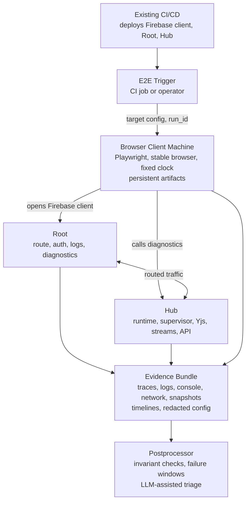

# Post-Deploy E2E Testing

This document defines the target architecture and roadmap for AdaOS browser
E2E tests. The initial mode is post-deploy verification: Firebase client,
Root, and Hub have already been updated by the existing CI/CD pipeline, and
the E2E runner verifies that the live subnet converged correctly.

Later, the same system can become a rollout gate.

## Scope

The E2E suite is not primarily a visual UI test suite. Its first job is to
validate the live runtime chain:

- Root routing and operational diagnostics are available
- Hub runtime is reachable and internally healthy
- browser client can connect as a durable browser device
- Yjs synchronization opens and remains stable
- materialized webspace data is populated
- API fallbacks remain coherent when Yjs or streams are degraded
- stream subscriptions deliver bounded snapshots
- diagnostics provide enough evidence for postprocess analysis

## Target Architecture



## Execution Model

The first production shape is a post-deploy canary:

```text
CI/CD deploy done
  -> trigger e2e-agent
  -> open Firebase client
  -> connect to real Root and Hub
  -> collect runtime snapshots
  -> assert materialization, Yjs, browser session, streams, and hard errors
  -> save evidence bundle
  -> publish report
```

The result should be one of:

- `passed`: target invariants were satisfied
- `failed`: target invariants were violated and evidence was collected
- `inconclusive`: the runner could not verify the target due to runner,
  network, credentials, or missing-diagnostics problems

## Browser Client Machine

The Browser Client Machine is a stable external observer of the deployed
system. It should be boring and reproducible:

- fixed Playwright and browser versions
- synchronized clock
- access to Firebase Hosting, Root API, and routed Hub API
- no developer-local state dependencies
- persistent artifact storage
- secrets outside the repository
- enough CPU and memory for multi-browser storm profiles

The runner should use an explicit durable browser identity, for example:

```text
browserDeviceId = e2e-browser-01
webspaceId = e2e or the selected canary webspace
```

The Hub should have an explicit permanent browser access link for this device.
The HTTP diagnostics path can use the existing AdaOS control token model,
where the Hub accepts `ADAOS_TOKEN` through `X-AdaOS-Token`,
`Authorization: Bearer`, or `?token=`.

The first runner does not have to wait for a dedicated machine. A local or CI
runner can validate the contract first. The dedicated Browser Client Machine is
the hardening step that makes repeated post-deploy checks reproducible.

## Safety Profiles

Post-deploy E2E targets a live deployed subnet, so the runner must make its
mutation policy explicit:

- `observe`: read-mostly checks, browser load, diagnostics, snapshots, and
  passive stream subscriptions only
- `canary`: writes are allowed only in a dedicated canary webspace or for an
  explicit canary browser device
- `storm`: multi-browser reconnect and stream pressure tests, allowed only for
  an explicitly approved target and time window
- `soak`: long-running observation, bounded stream pressure, no destructive
  actions unless the target is a dedicated canary subnet

The first useful implementation should start with `observe`.

## Evidence Bundle

Every run should produce a self-contained bundle:

```text
artifacts/e2e-runs/<timestamp>-<run_id>/
  manifest.json
  config.redacted.json
  client/
    playwright-report/
    traces/
    console.ndjson
    network.ndjson
    ws-lifecycle.ndjson
  root/
    snapshots/
    logs/
  hub/
    snapshots/
    logs/
  snapshots/
    before.json
    after.json
    node-status.json
    status-cards.json
    reliability-summary.json
    yjs-runtime.json
    materialization.json
    yjs-load-mark.json
    stream-guard.json
  postprocess/
    timeline.ndjson
    analysis-input.json
    analysis.md
```

Where possible, records should include:

- `run_id`
- `subnet_id`
- `hub_id`
- `webspace_id`
- `browser_device_id`
- `browser_session_id`
- `yws_attempt_id`
- stream receiver
- route key or routed target

## Observability Contract

Observability is part of the E2E product, not a later debugging add-on. The
first runner should write evidence before it attempts deep assertions.

All snapshots and probe records should use a small common envelope:

```json
{
  "schema": "adaos.e2e.snapshot.v1",
  "run_id": "e2e-20260525-001",
  "observed_at": "2026-05-25T12:00:00Z",
  "source": "runner|browser|root|hub",
  "target": "materialization|yjs_runtime|reliability|status_cards|network",
  "status": "ok|failed|unavailable|skipped",
  "duration_ms": 123,
  "payload": {}
}
```

The runner should also record clock and latency context:

- runner local timestamp
- Root ping timestamp and round-trip latency when available
- Hub ping timestamp and round-trip latency when available
- estimated clock offset for Root and Hub when the endpoint exposes server time

This makes cross-process timelines usable even when browser, Root, and Hub logs
come from different machines.

### Redaction And Retention

Artifacts must be useful without leaking credentials:

- never store raw `Authorization`, `X-AdaOS-Token`, session JWTs, refresh
  tokens, or query `token` values
- redact token-like URL query parameters before writing network logs
- store redacted config separately from the in-memory runtime config
- cap successful-run artifact size more aggressively than failed-run artifacts
- retain failed and inconclusive bundles longer than successful bundles
- record redaction version in `manifest.json`

### Failure Taxonomy

Every failed or inconclusive run should end with one primary category:

- `runner_unavailable`
- `target_unreachable`
- `credentials_invalid`
- `diagnostics_missing`
- `browser_boot_failed`
- `auth_denied`
- `root_route_degraded`
- `hub_runtime_unhealthy`
- `browser_session_missing`
- `yjs_connect_failed`
- `materialization_incomplete`
- `stream_delivery_failed`
- `ui_data_empty`
- `guard_rejected`
- `postprocess_failed`
- `inconclusive`

Specific checks may attach secondary evidence, but the primary category keeps
reports searchable and helps repeated LLM findings become deterministic rules.

## Initial Invariants

The first useful assertions should be runtime-contract assertions:

- Firebase client loads without fatal browser errors
- browser authorization preflight allows the E2E browser device
- browser session becomes connected in Hub diagnostics
- Yws connection opens and is not immediately rejected
- materialization endpoint reports `ready=true`
- materialization has no unexpected `missing_branches`
- webspace data visible to the browser is not silently empty
- reliability summary is available and does not report unexpected route failure
- stream receivers requested by the browser receive initial snapshots
- no unexpected `auth_required`, reconnect loop, or guard rejection remains at end

## Postprocess And LLM Triage

LLM analysis is useful during the early phase, but it must not become the only
oracle. The intended loop is:

1. deterministic checks find or suspect a problem
2. postprocessor extracts a compact timeline and failure window
3. LLM reviews the compact evidence bundle
4. repeated findings become deterministic checks

The postprocessor should identify patterns such as:

- `materialization.ready=false` after successful deployment
- non-empty `missing_branches`
- browser sees empty data while API materialization is populated
- repeated short Yws sessions
- mass `replaced_by_new_yws_session`
- `auth_required` for the fixed E2E browser device
- stream snapshot requested but not delivered
- Root route degraded while Hub reports runtime ready
- Yjs owner guard throttles or blocks outside an expected storm profile
- high stream-control `superseded`, `dropped`, or stale counters

## Roadmap

- [ ] M0. Define post-deploy mode
  - E2E runs after existing CI/CD has deployed Firebase client, Root, and Hub.
  - E2E does not block rollout initially.
  - E2E publishes `passed`, `failed`, or `inconclusive`.
  - Safety profiles are defined as `observe`, `canary`, `storm`, and `soak`.
  - Exit: a manually triggered post-deploy run can target a live subnet.

- [ ] M1. Build runner skeleton
  - Runner can execute locally or from CI before a dedicated Browser Client
    Machine exists.
  - Runner creates a run directory and writes `manifest.json`.
  - Runner publishes `passed`, `failed`, or `inconclusive` for health probes.
  - Exit: a no-browser health-probe run completes against a deployed target.

- [ ] M2. Add target config and run metadata
  - Define `firebaseClientUrl`, `rootApiUrl`, `hubApiUrl` or routed Hub URL.
  - Define `subnetId`, `webspaceId`, `browserDeviceId`, and secrets.
  - Generate a unique `run_id` for every run.
  - Include `run_id` in bundle paths, manifest, snapshots, and browser metadata
    where available.
  - Keep secrets out of the repository.
  - Print a redacted config into the evidence bundle.
  - Exit: runner performs health probes and writes a redacted, correlated
    bundle.

- [ ] M3. Build minimal evidence bundle
  - Collect Root and Hub health probes.
  - Collect clock and latency context.
  - Collect browser console and network logs when a browser is used.
  - Collect materialization, Yjs runtime, reliability summary, and status cards
    when endpoints are available.
  - Apply redaction before writing artifacts.
  - Exit: every run, including failure before browser launch, leaves enough
    evidence to classify the failure boundary.

- [ ] M4. Make browser access explicit
  - Create a permanent browser access link for the E2E browser device.
  - Verify `/api/browser/session/authorize` allows the device.
  - Record the browser device id in all E2E runs.
  - Exit: Yws opens without login or `auth_required` loops.

- [ ] M5. Provision Browser Client Machine
  - Install Node, Playwright, and stable browsers.
  - Configure clock synchronization.
  - Configure access to Firebase, Root, and routed Hub.
  - Configure persistent artifact storage.
  - Exit: the machine can open the deployed Firebase client and call basic
    Root/Hub diagnostics.

- [ ] M6. Build full evidence bundle v1
  - Collect Playwright traces.
  - Collect browser console, network, and websocket lifecycle records.
  - Collect Root and Hub snapshots.
  - Collect materialization, Yjs runtime, reliability summary, status cards,
    Yjs load mark, and stream guard data.
  - Include redaction version, runner version, and target build identifiers.
  - Exit: every run, including success, leaves a self-contained bundle.

- [ ] M7. First post-deploy smoke
  - Open Firebase client from the Browser Client Machine.
  - Wait for browser session connected.
  - Wait for Yjs connected.
  - Check materialization readiness.
  - Check that data is not silently empty.
  - Check for fatal console and network errors.
  - Exit: the smoke passes repeatedly on a healthy deployed subnet.

- [ ] M8. Runtime contract checks
  - Compare API materialization, Yjs runtime, reliability summary, stream
    receiver activity, and browser-observed state.
  - Classify failures as API, Yjs, stream, fallback, browser, Root route, or
    inconclusive.
  - Map each failure to the shared failure taxonomy.
  - Exit: a failed run reports the broken runtime boundary instead of only a
    browser timeout.

- [ ] M9. Postprocessor v1
  - Build a timeline from bundle artifacts.
  - Extract a failure window around the first broken invariant.
  - Group records by browser session, webspace, Yws attempt, route, and stream
    receiver.
  - Exit: `postprocess/analysis-input.json` is small enough for LLM or manual
    review.

- [ ] M10. LLM-assisted triage
  - Feed compact postprocessed evidence to an LLM.
  - Store probable cause, evidence references, suspected component, and
    suggested deterministic check.
  - Keep LLM output advisory; it must not be required for pass/fail decisions.
  - Exit: repeated failures produce stable classifications.

- [ ] M11. Convert findings to deterministic checks
  - Promote repeated LLM findings into explicit assertions or event rules.
  - Add thresholds for reconnect rates, stream counters, Yjs pressure, and
    stale recovery.
  - Exit: known failure classes are detected without LLM.

- [ ] M12. Storm profile
  - Run several browser contexts.
  - Exercise reloads, reconnects, stream subscriptions, and route recovery
    observation.
  - Verify the system returns to a healthy baseline after the storm.
  - Require the `storm` safety profile and an explicitly approved target.
  - Exit: storm runs produce bounded artifacts and deterministic pass/fail
    criteria.

- [ ] M13. Soak profile
  - Run for 30 to 120 minutes.
  - Track browser sessions, Yjs pressure, stream guard counters, memory, route
    health, and recovery.
  - Require the `soak` safety profile and bounded artifact retention.
  - Exit: soak has explicit pass/fail thresholds and bounded artifact size.

- [ ] M14. Gate mode
  - Move from advisory post-deploy verification to canary gate.
  - Later, make selected smoke and contract profiles a rollout condition.
  - Exit: CI/CD can wait for E2E status and make an automated rollout decision.

## First Useful Vertical Slice

The first implementation should be intentionally small:

- runner has a target config
- runner creates `run_id`, manifest, and redacted config
- runner collects minimal health probes and evidence
- fixed browser access link exists
- runner opens deployed Firebase client
- runner checks browser session, Yjs, materialization, reliability summary, and
  hard browser errors

This validates the real deployed chain without needing isolated Root or Hub
test infrastructure or a fully hardened Browser Client Machine.
