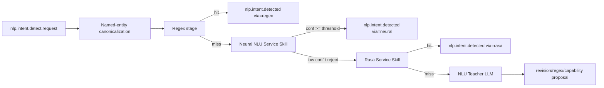

# NLU Target Architecture (Neural Intent Detector)

This document defines the **target architecture** for integrating a neural intent detector (reference: `Fla1lx/neural-network-module-for-determining-user-intent`) into AdaOS.

## Why this architecture

The referenced detector combines:

- Char-CNN + BiLSTM encoder,
- hybrid ranking (softmax + FAISS k-NN + skill priors),
- entity masking (`{time}`, `{city}`, `{number}`, ...),
- contrastive-friendly embedding space.

For AdaOS, this is a good fit between regex (fast deterministic) and LLM teacher (fallback + governance).

## Target runtime shape



## Components

### 0) Named-entity canonicalization

Named entities are resolved before the neural or Rasa model is treated as final.
This layer is owned by core AdaOS and reuses the shared named-entity registry:

- device, browser, node, webspace, scenario, skill, app, and modal names are
  resolved to canonical refs;
- request text can be normalized to placeholders such as `{device}`,
  `{scenario}`, `{skill}`, or `{app}`;
- ambiguity and unresolved spans are recorded in NLU trace;
- model providers receive canonicalization evidence but do not learn local
  device names as permanent behavior.

This keeps model training focused on intent shape while runtime names remain
governed operational data.

### 1) Neural NLU Service Skill (`runtime.kind=service`)

A dedicated service skill with its own Python environment and lifecycle
supervision.

The neural provider is installed as a workspace/registry skill. It must not be
bundled as core Python package data, and the hot parse path must not create or
switch A/B runtime slots. Install/update flows own provider preparation.

Target install policy:

- `adaos install --neural-nlu` prepares Neural NLU; plain `adaos install`
  skips the provider and its heavy dependencies.
- `ADAOS_NLU_NEURAL=1` forces the runtime stage, and `ADAOS_NLU_NEURAL=0`
  disables it.
- With the flag unset, the pipeline uses Neural only when
  `neural_nlu_service_skill` is installed/active.
- Rasa remains available as a long-term fallback after neural abstain/error.

Responsibilities:

- load model weights + tokenizer/masking config,
- expose `/health` and `/parse`,
- optionally expose `/reindex` for FAISS,
- return intent candidates with confidence and evidence.

### 2) Neural inference contract

`POST /parse` request:

```json
{ "text": "поставь будильник на 7:30", "webspace_id": "ws_1", "locale": "ru" }
```

Response:

```json
{
  "top_intent": "alarm.set",
  "confidence": 0.91,
  "alternatives": [{"intent":"timer.start","confidence":0.05}],
  "slots": {"time":"07:30"},
  "via": "neural",
  "model_id": "node-default-2026-05-16",
  "evidence": {
    "softmax": 0.82,
    "knn": 0.88,
    "skill_prior": 0.9,
    "matched_examples": ["поставь будильник на {time}"],
    "canonicalized_text": "поставь будильник на {time}",
    "source_intent": "alarm.set",
    "intent_mapping": {
      "source_label": "alarm.set",
      "canonical_intent": "alarm.set",
      "action_id": "system.alarm.set"
    }
  }
}
```

### 3) Hub bridge (`adaos.services.nlu.neural_service_bridge`)

Responsibilities:

- subscribe to `nlp.intent.detect.request`,
- invoke neural service with timeout/retry,
- apply confidence gates (`accept`, `abstain`, `reject`),
- emit:
  - `nlp.intent.detected` (`via="neural"`), or
  - `nlp.intent.not_obtained` / `nlp.intent.detect.rasa` fallback.
- collect usage statistics for later model-splitting decisions.

### 4) Data and model registry

Model and index artifacts are owned by the neural service skill runtime, not by
the core AdaOS package. The initial policy is one active model per node. Future
per-locale, per-webspace, or per-profile models should be introduced only when
usage statistics show a real need.

Versioned runtime artifacts:

- `model.pt`
- `faiss.index`
- `faiss.index.json` for index provenance/invalidation metadata
- `negative_faiss.index`
- `negative_faiss.index.json` for negative-index provenance/invalidation metadata
- `intents_manifest.json`
- `intent_map.json` for mapping research labels to canonical intents and
  optional system action ids
- `masking_rules.json`
- `examples_manifest.jsonl`
- `ranker_config.json`
- `metrics.json`

Current implementation note: the service can already create and reuse lazy
positive-example and negative-example FAISS indexes when `faiss` is installed
in the service venv. If FAISS is unavailable, it falls back to persisted Torch
tensor caches. The active artifact layout also includes `intent_map.json` so
notebook labels can map to AdaOS canonical intents and optional action ids
without changing the model.

Model lifecycle:

- immutable model versions (`model_id`),
- one active node-level pointer initially,
- optional canary switch per webspace later,
- rollback by pointer change.

### 5) Governance and observability

Mandatory telemetry fields:

- latency (`stage=neural`),
- confidence distribution,
- fallback ratio (`neural -> rasa -> teacher`),
- per-intent precision/recall (offline eval),
- rejected/abstained samples for Teacher queue.
- provider version and `model_id`,
- canonicalization hit/miss/ambiguity counts,
- per-intent accept/abstain/reject counts,
- matched-example evidence for accepted neural decisions.

The statistics are intentionally part of the first node-level model rollout.
They are the evidence we need before deciding whether multiple models by
locale, webspace, profile, hardware class, or domain are justified.

### 6) Training data ownership

Curated examples are stored with the owner of the behavior:

- skill actions -> the owning skill;
- scenario flows -> the owning scenario;
- core/client actions -> a versioned system action catalog;
- aliases and display names -> named-entity authoritative sources.

The system action catalog covers built-in UI/kernel/client commands such as
move, hide, open, pin, switch, and similar shell behavior. These actions should
not be represented as fake user skills just to feed NLU. The catalog gives all
providers stable action ids, schemas, aliases, and training examples while
keeping execution authority in the core/client subsystem.

## Target decision policy

1. **Regex hit**: immediate accept.
2. **Neural high confidence** (`>= T_accept`): accept as final.
3. **Neural uncertainty** (`T_reject < conf < T_accept`): delegate to Rasa.
4. **No intent after Rasa**: delegate to Teacher.

Recommended initial thresholds:

- `T_accept = 0.80`
- `T_reject = 0.45`

Tune per locale/domain after offline evaluation.

## Implementation roadmap

Status labels follow [nlu-roadmap.md](./nlu-roadmap.md): `[deferred]` means
the item is intentionally postponed, and `[polish]` means hardening after the
first functional slice.

## Phase 0 — Preparation (1 sprint)

- Define event and HTTP contracts for neural stage.
- Create `neural_nlu_service_skill` as a registry/workspace service skill
  (healthcheck, config, supervisor integration).
- Remove provider delivery through `src/adaos/interpreter_data`.
- Add feature flags:
  - `ADAOS_NLU_NEURAL=1`
  - `ADAOS_NLU_NEURAL_TIMEOUT_S`
  - `ADAOS_NLU_NEURAL_MODEL_ID`

**Exit criteria:** service is startable, observable, installed by install/update
flows, and no-op safe when disabled.

## Phase 1 — Inference MVP (1–2 sprints)

- Integrate inference-only model (`model.pt` + preprocessing/masking).
- Implement `/parse` and hub bridge.
- Add confidence gating + fallback to Rasa.
- Add telemetry and structured logs.

**Exit criteria:** end-to-end event flow works, no regressions in existing regex/rasa path.

## Phase 2 — Hybrid ranking (1 sprint)

- Add FAISS retrieval and weighted scorer.
- Add positive and negative example indexes.
- Externalize weights:
  - `w_softmax`, `w_knn`, `w_skill_prior`.
- Log score components in `evidence`.

**Exit criteria:** measurable improvement on dev set and stable latency budget.

## Phase 3 — Teacher loop integration (1 sprint)

- Push abstained/low-confidence utterances to NLU Teacher queue.
- Teacher can propose:
  - regex fixes,
  - dataset revisions,
  - new intent/skill candidates.
- `[deferred]` Add "accepted by teacher later" feedback channel for retraining.

**Exit criteria:** closed feedback loop from runtime misses to curated improvements.

## Phase 4 — ModelOps and rollout safety (1 sprint)

- Versioned model registry and node-level rollback pointer.
- `[deferred]` Canary rollout by webspace/tenant after node-level statistics justify it.
- `[polish]` Automatic quality gates before promoting model.

**Exit criteria:** controlled rollout with fast rollback and auditable model provenance.

## Phase 5 — Production hardening (ongoing)

- `[deferred]` Multi-locale packs.
- `[polish]` Quantization/perf optimization.
- `[polish]` Drift detection and periodic reindex/retrain.
- `[polish]` Security review for model/data supply chain.

## Compatibility with current AdaOS NLU

This target architecture preserves current AdaOS strategy:

- regex remains first-stage deterministic policy,
- named-entity canonicalization remains a core shared preprocessing layer,
- service-skill isolation remains the default runtime model,
- Rasa remains a long-term compatible fallback,
- Teacher remains improvement/governance mechanism.

The only structural change is adding a **neural service stage** between regex and Rasa.
